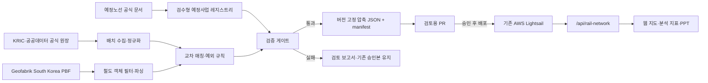
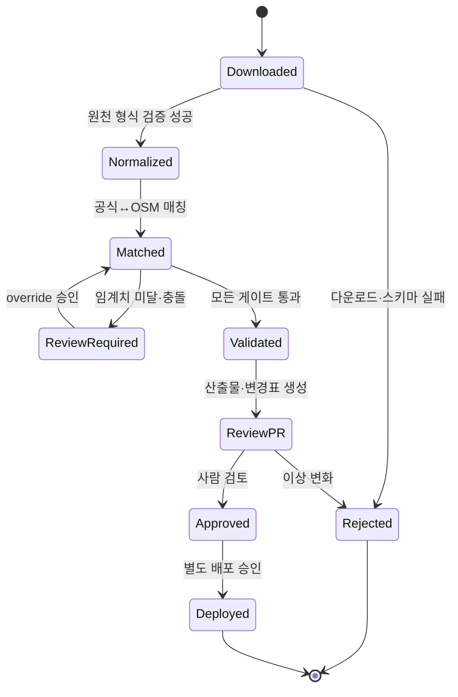
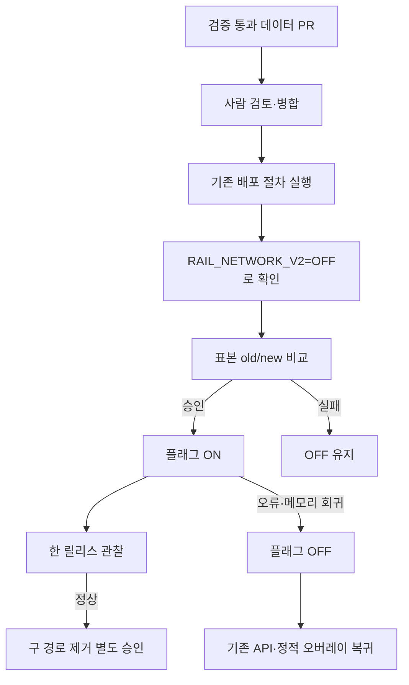

# 전국 철도 GIS 데이터 체계 전환 구현계획서

> 작성일: 2026-07-16  
> 상태: 구현 전 승인 계획  
> CEO 리뷰 모드: `HOLD_SCOPE`  
> 선택안: C — 자체 전국 철도 GIS 생성 파이프라인(C-lean)  
> 비용 계약: 기존 AWS Lightsail 요금제 안에서 운영하며 추가 월 비용을 발생시키지 않는다.

## 1. 결론

철도집의 비공개 구현이나 API를 재사용하지 않는다. 공공데이터의 역·노선 기준정보와 OpenStreetMap(OSM)의 선형·출입구 지오메트리를 우리 파이프라인에서 결합해, 버전이 고정된 전국 철도 스냅샷을 만든다.

대용량 원본 PBF 처리와 정합성 검사는 로컬 PC 또는 GitHub Actions 배치에서만 수행한다. 기존 AWS에는 검증을 통과한 압축 JSON 산출물과 조회 API만 배포한다. 상시 PostGIS, 신규 서버, 유료 지도·ETL 서비스, AWS 사양 증설은 도입하지 않는다.

웹 지도, 현재 접근성 지표, 분석 미리보기와 PPT가 모두 동일한 `snapshotVersion`과 동일한 철도 API 응답을 사용하도록 통합한다. 개통 예정 노선은 현재 운영 노선과 분리하며 현재 역 개수나 접근성 점수에 포함하지 않는다.

## 2. 문제 정의와 근거

현재 앱에는 서로 독립적인 철도 데이터 경로가 세 개 존재한다.

1. `/api/poi-search`가 Overpass에서 역을 실시간 조회해 분석 지표를 만든다.
2. `/api/subway-routes`가 OSM route relation을 실시간 조회해 노선 선형을 만든다.
3. `public/data/osm-subway.json`이 웹 지도 오버레이를 제공하며, 정적 오버레이가 표시되면 실시간 표시가 억제된다.

이 구조에서는 같은 주소를 분석해도 웹 지도, 수치, PPT가 서로 다른 역·노선 집합을 사용할 수 있다. 실측 표본에서는 환승역이 한 노선으로 축약되고, 노선이 `미확인`으로 남거나, 중복 relation과 짧은 선형 조각이 포함되는 현상이 확인됐다. 정적 스냅샷은 생성기가 저장소에 없고 자동 갱신 경로도 없다. OSM을 사용하는 지도에서 화면상 저작자 표시도 비활성화되어 있다.

기존 좌표 검증 스크립트는 111/111을 통과하고 Overpass 조회 테스트도 성공하지만, 공식 역 목록 대비 누락률, 환승 소속 노선, `미확인` 비율, 노선 중복·단절, 웹/PPT 정합성, OSM 저작자 표시를 검증하지 않는다.

## 3. 목표와 성공 조건

- 도시철도와 광역철도를 전국 단위의 하나의 정규화된 데이터 계약으로 제공한다.
- 운영 중인 역은 공식 코드와 복수 노선 소속을 보존하고 `미확인` 노선을 0건으로 만든다.
- 웹, 분석 지표, 미리보기, PPT가 같은 스냅샷 버전을 사용한다.
- 예정 노선은 출처·기준일·신뢰도·사업 상태를 표시하고 현재 접근성 산정에서 제외한다.
- 데이터 갱신 실패가 사용자 요청 실패나 잘못된 데이터 자동 배포로 이어지지 않게 한다.
- 기존 1GB급 Lightsail에서 응답 p95 300ms 이하, 런타임 메모리 증가 100MB 미만을 목표로 한다.
- 추가 월 비용은 0원이어야 한다.

## 4. 범위 결정

### 포함

- 도시철도와 제품에서 지하철로 취급하는 광역전철의 운영 역, 노선, 선형, 출입구
- KRIC/공공데이터의 공식 역·노선 기준정보 수집 및 정규화
- Geofabrik 대한민국 OSM PBF에서 철도 지오메트리 추출
- 공식 정보와 OSM 지오메트리의 교차 매칭 및 수동 예외 관리
- 개통 예정 철도 사업의 별도 레지스트리와 지도 레이어
- 인증된 `/api/rail-network` 조회 API
- 웹·분석·PPT의 동일 데이터 경로 전환
- 자동 검증, 검토용 PR 생성, 기능 플래그 롤백
- 웹과 출력물의 OSM 및 공공데이터 출처 표시

### NOT in scope

- KTX·일반철도·화물철도의 접근성 점수 반영: 현재 제품의 지하철 지표 의미를 바꾸므로 제외한다.
- 실시간 열차 위치·도착 정보: 위치 분석용 정적 네트워크와 별도 도메인이다.
- 상시 PostGIS 또는 GIS 서버: 현재 데이터 규모와 비용 제약에서 필요하지 않다.
- 신규 AWS 인스턴스, Lightsail 증설, 유료 API·타일·ETL: 추가 비용 0원 계약에 위배된다.
- 철도집 화면·네트워크의 스크래핑 또는 역공학: 공식 사용 허가와 안정적인 계약이 없다.
- 자동 운영 배포: 데이터 PR 검토와 사용자 승인 없이 배포하지 않는다.
- 1차 버전의 벡터 타일 서버: 압축 산출물 10MB 또는 API p95 300ms 기준을 넘을 때만 재검토한다.
- 예정 노선의 자동 점수 반영: 확정되지 않은 사업이 현재 가치로 오인될 수 있다.

## 5. What already exists

| 기존 자산 | 현재 역할 | 계획 |
|---|---|---|
| `src/lib/overpass.ts` 및 `/api/poi-search` | 일반 POI와 역 실시간 조회 | 일반 POI에는 재사용하고 철도만 신규 API로 이전 |
| `src/lib/overpass-subway-routes.ts` 및 `/api/subway-routes` | OSM 노선 실시간 조회 | 한 릴리스 동안 fallback으로 유지한 뒤 승인 후 제거 |
| `public/data/osm-subway.json` | 정적 지도 오버레이 | 신규 스냅샷 안정화 전 fallback으로 유지 |
| `src/lib/osm-subway-overlay.ts` | 정적 오버레이 로딩·필터링 | 데이터 계약을 일반화해 `rail-overlay.ts`로 대체 |
| `src/lib/naver-subway-mapper.ts` | 노선명 매핑 보조 | 실제 호출 여부를 확인한 뒤 alias 규칙으로 필요한 부분만 흡수 |
| `src/scripts/test-overpass-fetch.mjs` | Overpass 연동 확인 | 비철도 POI 회귀 테스트로 유지 |
| `src/scripts/verify-subway-coords.mjs` | 좌표 표본 확인 | 신규 공식 기준 정합성 검증으로 대체·확장 |
| 기존 AWS Lightsail/Next 배포 | 웹/API 제공 | 그대로 사용하며 압축 산출물만 추가 |

## 6. 공식 데이터 계약

### 운영 노선

우선순위는 다음과 같다.

1. KRIC 철도산업정보센터 도시·광역철도 역사정보: 역 기준정보의 1차 원장
2. 공공데이터포털 전국도시철도역사정보 표준데이터: 역 코드, 노선, 환승, 좌표, 운영기관 교차검증
3. 국토교통부 전체 도시철도 노선정보: 노선별 역 순서와 운영 범위 교차검증
4. OSM/Geofabrik: 노선 선형, 역 공간 객체, 출입구 지오메트리
5. TAGO: 향후 출입구·시간표 상세가 필요할 때만 선택적으로 사용

공식 데이터가 역의 정체성과 노선 소속의 기준이며, OSM은 공간 지오메트리의 기준이다. OSM 정보가 공식 정보와 충돌하면 자동으로 덮어쓰지 않고 검토 목록으로 보낸다.

### 예정 노선

예정 사업의 지오메트리 출처는 다음 순서로 채택한다.

1. 법적으로 재사용 가능한 공식 GIS/CAD/KTDB 자료
2. 실시계획 승인·고시의 지형도면 또는 공식 좌표
3. 공식 PDF 노선도를 기준점으로 지오리퍼런싱한 선형
4. 위 자료가 없을 때 공식 발표를 토대로 한 개략 선형

3~4단계는 `confidenceLabel`을 `medium` 또는 `low`로 표시하며, 정밀 위치처럼 표현하지 않는다. 상충하는 개통일은 하나로 덮어쓰지 않고 원 발표일, 수정 목표일, 확정 개통일을 별도 필드로 보존한다.

### 참고 출처

- [KRIC 전체 도시철도 역사정보](https://data.kric.go.kr/rips/M_01_01/detail.do?id=32)
- [전국도시철도역사정보 표준데이터](https://www.data.go.kr/data/15013205/standard.do)
- [국토교통부 전체 도시철도 노선정보](https://www.data.go.kr/data/15122916/fileData.do)
- [TAGO 지하철정보 API](https://www.data.go.kr/data/15098554/openapi.do)
- [Geofabrik South Korea OSM PBF](https://download.geofabrik.de/asia/south-korea.html)
- [OSM 저작권·ODbL 표시 요건](https://www.openstreetmap.org/copyright)

## 7. 목표 아키텍처



### 빌드 시점

- 월 1회 예약 실행과 수동 실행을 지원한다.
- GitHub Actions 무료 허용량 안에서 실행하며, 할당량 부족 시 로컬 PC에서 동일 명령을 실행한다.
- `.osm.pbf`는 임시 작업공간에서만 처리하고 AWS나 Git 저장소에 올리지 않는다.
- `osmium-tool`로 철도 관련 객체를 먼저 줄이고 Python `pyosmium` 기반 파서로 relation/way/node를 읽는다.
- 검증 성공 시에만 산출물과 변경 보고서를 담은 PR을 생성한다.
- main 병합이나 운영 배포는 자동화하지 않는다.

### 런타임

- Next 서버가 승인된 manifest와 압축 해제된 데이터 파일을 최초 요청 시 한 번 읽는다.
- bbox 선필터 후 정확한 거리 계산으로 요청 범위를 자른다.
- 웹·분석·PPT는 모두 같은 `/api/rail-network` 응답을 소비한다.
- 런타임에서 Overpass나 외부 철도 API를 호출하지 않는다.
- PBF, GDAL 서버, PostGIS는 운영 인스턴스에 설치하지 않는다.

## 8. 데이터 모델

### `RailNetworkSnapshot`

```ts
type RailNetworkSnapshot = {
  schemaVersion: string;
  snapshotVersion: string;
  generatedAt: string;
  sourceManifest: RailSourceManifest[];
  stations: RailStation[];
  lines: RailLine[];
  routeSegments: RailRouteGeometry[];
  entrances: RailEntrance[];
};
```

### 핵심 규칙

- `RailStation.id`: 공식 운영기관·노선·역 코드를 기반으로 한 안정 ID
- `RailStation.memberships[]`: 환승역의 모든 노선 소속을 배열로 보존
- `RailLine`: 이름, 운영기관, 색상, mode, status, aliases 포함
- `RailRouteGeometry.segments[][]`: 단절된 선형을 억지로 하나의 체인으로 연결하지 않음
- `RailEntrance`: 역 ID, OSM 객체 ID, 좌표, 명칭, 접근성 태그 포함
- 모든 레코드는 원천 식별자와 원천 기준일을 추적할 수 있어야 함

### `PlannedRailProject`

```ts
type PlannedRailProject = {
  projectId: string;
  lineName: string;
  segmentScope: string;
  lifecycleStatus: "proposed" | "approved" | "under_construction" | "opening_confirmed";
  geometry: GeoJSON.MultiLineString;
  stations: PlannedRailStation[];
  targetOpeningDate?: string;
  revisedTargetOpeningDate?: string;
  confirmedOpeningDate?: string;
  constructionCompletionDate?: string;
  referencePeriod: string;
  sourcePublicationDate: string;
  sourceUrl: string;
  sourceType: "official_gis" | "official_notice" | "georeferenced_pdf" | "approximation";
  confidenceLabel: "high" | "medium" | "low";
  freshnessState: "fresh" | "review_due" | "stale";
  conflictState: "none" | "date_conflict" | "geometry_conflict";
  lastVerifiedAt: string;
};
```

### 매칭 규칙

1. 공식 운영기관·노선·역 코드를 1차 키로 사용한다.
2. OSM 객체는 alias가 적용된 정규화 역명, 노선명, 공간 근접도를 함께 사용한다.
3. 자동 매칭이 모호하면 `data/rail/match-overrides.json`에 근거와 함께 명시한다.
4. 공식 좌표와 OSM 좌표 차이가 200m를 넘으면 자동 승인하지 않는다.
5. alias와 override 변경은 코드리뷰 대상이며 manifest에 해시를 남긴다.

## 9. API 계약

```http
GET /api/rail-network?lat=37.4979&lng=127.0276&radius=3000&include=operational,planned&detail=analysis
```

```json
{
  "snapshotVersion": "2026-07-rail-v1",
  "stations": [],
  "lines": [],
  "routeSegments": [],
  "entrances": [],
  "plannedProjects": [],
  "sources": []
}
```

- 기존 분석 API와 동일한 인증 정책을 적용한다.
- 위·경도, radius, include, detail을 allowlist 방식으로 검증한다.
- radius에는 제품 기준 상한을 둔다.
- `detail=analysis`는 역과 노선 중심, `detail=map`은 필요한 선형과 출입구를 포함한다.
- 응답에는 반드시 `snapshotVersion`과 출처 기준일을 포함한다.
- 예정 노선은 운영 역 배열과 분리하고 서버에서도 현재 접근성 계산에 들어가지 않게 한다.

## 10. 데이터 흐름과 상태



Shadow path는 기존 Overpass/정적 오버레이이며, 기능 플래그가 꺼졌거나 신규 데이터 로딩이 실패했을 때만 사용한다. 신규·기존 결과를 한 릴리스 동안 비교 로깅하되 사용자 화면에 두 결과를 섞지 않는다.

## 11. 구현 단계와 파일 단위 작업

### Phase 0 — 계약과 안전장치 고정

- `src/lib/types.ts`
  - 운영 철도, 예정 철도, source status, snapshot version 타입을 정의한다.
- `docs/` 또는 운영 문서
  - 지하철 범위, 예정 노선 비산정, 출처·라이선스, 추가 비용 0 계약을 기록한다.
- 환경 설정
  - `RAIL_NETWORK_V2` 기능 플래그를 추가한다. 신규 API 실패 시 기존 경로로 되돌릴 수 있어야 한다.

검증: 타입 검사와 환경변수 미설정 시 기존 경로 유지 테스트.

### Phase 1 — 자체 스냅샷 생성기

신규 파일:

- `scripts/rail/requirements.txt`
- `scripts/rail/fetch_sources.py`
- `scripts/rail/normalize.py`
- `scripts/rail/build_snapshot.py`
- `scripts/rail/validate_snapshot.py`
- `scripts/rail/README.md`
- `data/rail/line-aliases.json`
- `data/rail/match-overrides.json`
- `data/rail/planned/*.json`

생성 파일:

- `public/data/rail/manifest.json`
- `public/data/rail/operational.json`
- `public/data/rail/planned.json`

작업:

1. 원본 파일 URL, 취득 시각, 원본 SHA256, 라이선스를 기록한다.
2. 공식 역·노선 행을 표준 내부 모델로 정규화한다.
3. PBF에서 도시·광역철도 relation/way/node/entrance만 추출한다.
4. 공식 역과 OSM 객체를 매칭하고 미매칭·다중 후보 보고서를 만든다.
5. route relation 변형을 중복 판별하며 실제로 단절된 segment는 보존한다.
6. 예정 사업 레지스트리의 스키마와 freshness/conflict 계산을 구현한다.
7. 검증 성공 시 결정론적 순서의 산출물과 manifest를 만든다.

검증 명령 예시:

```bash
python -m pip install -r scripts/rail/requirements.txt
python scripts/rail/fetch_sources.py --cache .cache/rail
python scripts/rail/build_snapshot.py --cache .cache/rail --out public/data/rail
python scripts/rail/validate_snapshot.py public/data/rail/manifest.json
```

### Phase 2 — 로컬 저장소와 API

신규 파일:

- `src/lib/server/rail-network-store.ts`
- `src/app/api/rail-network/route.ts`
- `src/lib/rail-overlay.ts`
- `src/scripts/test-rail-network-store.mjs`
- `src/scripts/validate-rail-snapshot.mjs`

작업:

1. manifest의 schema, 파일 존재, SHA256를 확인한 뒤에만 메모리에 올린다.
2. 프로세스 내 읽기 전용 캐시와 bbox 인덱스를 만든다.
3. 인증·입력 검증·거리 필터가 적용된 API를 구현한다.
4. 산출물 손상 시 오류를 기록하고 기능 플래그 fallback이 작동하게 한다.
5. 응답에서 운영 데이터와 예정 데이터를 분리한다.

검증:

```bash
node src/scripts/validate-rail-snapshot.mjs
node src/scripts/test-rail-network-store.mjs
npm run typecheck
```

### Phase 3 — 웹 지도와 분석 전환

수정 파일:

- `src/lib/data-provider.ts`
- `src/app/api/poi-search/route.ts`
- `src/components/site-analysis-app.tsx`
- `src/components/map-view.tsx`
- `src/components/sidebar.tsx`

작업:

1. 철도역 분석을 `/api/rail-network`로 전환하고 비철도 POI만 Overpass에 남긴다.
2. 지도 선형·역·출입구가 같은 응답을 사용하게 한다.
3. 운영/예정 토글을 분리하고 예정 노선은 점선·낮은 불투명도·상태 배지로 표시한다.
4. 환승역은 하나의 역으로 세되 소속 노선을 모두 표시한다.
5. 출처와 기준일, 데이터 상태, OSM attribution을 지도에 항상 표시한다.
6. 기존 API와 오버레이는 기능 플래그 fallback으로 유지한다.

검증: 서울 강남, 서울 시청, 부산 서면, 대구 반월당, 대전 시청, 광주 상무, 광역전철 표본에서 데스크톱·모바일 지도와 수치를 비교한다.

### Phase 4 — PPT와 분석 결과 정합성

수정 파일:

- `src/lib/ppt-canvas-renderer.ts`
- `src/lib/ppt-generator.ts`
- 철도 출처 슬라이드 관련 파일

작업:

1. PPT 생성 입력에 `snapshotVersion`과 동일한 rail response를 전달한다.
2. 웹에서 보인 역·노선과 PPT에 그리는 역·노선이 동일한지 검증한다.
3. 예정 사업은 별도 범례와 출처·확인일을 사용한다.
4. 실제 사용하지 않는 “Naver + OSM” 표기를 정확한 공공데이터·OSM 출처로 교체한다.
5. OSM attribution을 인쇄 가능한 크기로 넣는다.

검증: 동일 분석 ID의 웹/PPT snapshot version, 역 개수, 환승 노선, 예정 노선 포함 여부를 자동 비교한다.

### Phase 5 — 자동 갱신 워크플로

신규 파일:

- `.github/workflows/rail-data-refresh.yml`

작업:

1. 월 1회 및 `workflow_dispatch`로만 실행한다.
2. 캐시는 원본 다운로드 최적화에만 사용하고 승인 산출물의 출처로 간주하지 않는다.
3. 검증 실패 시 artifact와 보고서만 보존하고 PR을 만들지 않는다.
4. 성공 시 역 증감, 노선 증감, 미매칭, 좌표 충돌, 예정 사업 변경을 포함한 검토용 PR을 만든다.
5. 자동 병합·자동 배포 권한은 주지 않는다.
6. 무료 Actions 한도 부족 시 README의 로컬 실행 절차를 사용한다.

### Phase 6 — 수용 테스트, 배포, 관찰

1. 기능 플래그 OFF 상태로 배포한다.
2. 내부 표본 분석에서 old/new 결과를 비교한다.
3. 기준 통과 후 사용자 승인으로 플래그를 ON 한다.
4. 한 릴리스 동안 오류율, API 시간, 메모리, fallback 횟수를 관찰한다.
5. 안정화와 별도 승인 후에만 구 철도 endpoint와 정적 오버레이를 제거한다.

## 12. 검증 게이트

| 영역 | 통과 기준 |
|---|---|
| 공식 원장 파싱 | 100% 파싱 또는 이유가 있는 rejected 목록 |
| 노선 식별 | 운영 역의 `미확인` 0건 |
| 환승 | 모든 공식 노선 membership 보존 |
| OSM 매칭 | 공식 역의 자동+승인 매칭 98% 이상, 나머지는 명시 보고 |
| 좌표 | 공식↔OSM 200m 초과 자동 승인 금지 |
| 선형 | 500m 초과 인공 연결 없음, 실제 segment 보존 |
| 중복 | relation 변형 중복 검출 보고 존재 |
| 신선도 | 공식 역 원장 400일 초과 시 production PR 차단 |
| 예정 사업 | 90일 미확인 warning, 180일 초과 stale 표시 또는 숨김 |
| 무결성 | 모든 배포 파일 SHA256 manifest 포함 |
| 정합성 | 웹·분석·PPT `snapshotVersion`과 역 개수 일치 |
| 제품 의미 | 예정 역이 현재 접근성 지표에 0건 반영 |
| 라이선스 | 웹·PPT에서 OSM 및 공공 출처 표시 |
| 성능 | API p95 < 300ms, 메모리 증가 < 100MB |
| 크기 | 압축 산출물 10MB 이하; 초과 시 분할 설계 재검토 |

## 13. Error & Rescue Registry

| Method / 단계 | 실패 종류 | Rescue | 조치 | 사용자 영향 |
|---|---|---:|---|---|
| 공식 파일 다운로드 | 네트워크·URL 변경 | Y | 이전 승인본 유지, 작업 실패 보고 | 없음 |
| Geofabrik 다운로드 | 네트워크·원본 지연 | Y | 이전 승인본 유지, 수동 재실행 | 없음 |
| 원본 스키마 파싱 | 열 변경·인코딩 | Y | fail closed, rejected report | 없음 |
| 공식↔OSM 매칭 | 모호·누락 | Y | PR 차단, override 검토 | 없음 |
| route 조립 | 단절·중복 relation | Y | segment 보존, 중복 보고 | 없음 또는 구 버전 유지 |
| 예정 문서 해석 | 날짜·선형 충돌 | Y | conflict 표시, 자동 덮어쓰기 금지 | 충돌 배지 표시 |
| 산출물 생성 | 비결정적·손상 | Y | hash/schema 실패로 게시 차단 | 없음 |
| GitHub Actions | 무료 한도 소진 | Y | 동일 로컬 명령으로 생성 | 갱신 지연 |
| PR 검토 | 비정상 대량 증감 | Y | 승인 보류, 이전본 유지 | 없음 |
| API manifest 로드 | 파일 누락·hash 불일치 | Y | 신규 경로 비활성, 기존 fallback | 오래된 데이터 가능 |
| API 조회 | 잘못된 좌표·radius | Y | 400 응답, 안전 메시지 | 해당 요청 실패 |
| API 런타임 | 메모리 압박 | Y | lazy load/cache 제한, flag rollback | 일시 fallback |
| 웹 렌더 | 선형 과다·브라우저 부하 | Y | bbox/detail 축소 | 일부 상세 생략 가능 |
| PPT 렌더 | attribution·선형 잘림 | Y | 생성 전 parity 검사 실패 | PPT 생성 중단·재시도 |
| 운영 전환 | 신규 데이터 회귀 | Y | 기능 플래그 OFF | 기존 동작 복귀 |

## 14. Failure Modes Registry

| CODEPATH | FAILURE MODE | RESCUED? | TEST? | USER SEES? | LOGGED? |
|---|---|---:|---:|---|---:|
| fetch_sources | 공식 원본 불가 | Y | Y | No | Y |
| normalize | 필드·인코딩 변경 | Y | Y | No | Y |
| matcher | 매칭률 임계치 미달 | Y | Y | No | Y |
| geometry | 인공 장거리 연결 | Y | Y | No | Y |
| planned registry | 날짜 충돌 | Y | Y | Conflict label | Y |
| validator | stale source | Y | Y | No | Y |
| artifact writer | hash 불일치 | Y | Y | No | Y |
| rail store | manifest load 실패 | Y | Y | Old data/fallback | Y |
| rail API | 입력 범위 초과 | Y | Y | Validation error | Y |
| web map | OSM attribution 누락 | Y | Y | Release blocked | Y |
| PPT | 웹 결과 불일치 | Y | Y | Export blocked | Y |
| deployment | 성능·메모리 회귀 | Y | Y | Fallback | Y |

`RESCUED=N, TEST=N, USER SEES=Silent`인 치명적 공백은 계획상 0건이다.

## 15. 보안과 라이선스

- 신규 API는 현재 분석 API와 같은 인증·rate limit 경계를 사용한다.
- 위·경도와 radius를 수치 범위로 검증해 과도한 응답과 메모리 사용을 막는다.
- 원천 URL은 설정 allowlist로 제한하며 빌드 스크립트가 임의 URL을 받지 않게 한다.
- 외부 파일은 해시, 크기, 스키마를 검사하고 파서에 실행 권한을 주지 않는다.
- GitHub workflow에는 운영 AWS 자동 배포 자격증명을 넣지 않는다.
- 공공데이터별 이용조건과 기준일을 manifest에 보존한다.
- OSM 사용 화면과 PPT에 `© OpenStreetMap contributors` 및 링크를 표시한다.
- OSM 표준 타일을 대량 사전다운로드하지 않는다. 현재 지도 타일 정책은 별도 준수한다.

## 16. 관측 가능성과 운영

- 빌드 보고서: 원천 버전, 역·노선·출입구 개수, 증감률, 미매칭, 충돌, stale 항목
- API 로그: `snapshotVersion`, 소요 시간, 응답 개수, fallback 여부; 주소나 불필요한 개인정보는 남기지 않음
- 런타임 지표: p50/p95, manifest load 실패, 메모리, fallback 횟수
- 화면 진단: 사용 중인 snapshot version과 기준일을 출처 패널에서 확인 가능
- PPT 진단: 메타데이터 또는 출처 슬라이드에 snapshot version 표시

## 17. 배포와 롤백



롤백은 데이터 마이그레이션을 되돌리는 방식이 아니라 기능 플래그를 끄는 방식이다. 구 경로는 신규 경로가 한 릴리스 안정화될 때까지 삭제하지 않는다. 데이터 자체가 문제면 이전 manifest와 산출물을 재배포한다. 모든 운영 배포와 플래그 전환은 사용자 승인을 거친다.

## 18. 비용 상한

| 항목 | 계획 |
|---|---|
| 기존 AWS Lightsail | 현재 요금제 유지 |
| AWS 증설·추가 인스턴스 | 금지 |
| 관리형 DB/PostGIS | 사용 안 함 |
| GitHub Actions | 무료 허용량 내 월 1회; 초과 시 로컬 실행 |
| Geofabrik/OSM | 공개 데이터 사용, 라이선스·attribution 준수 |
| KRIC/공공데이터 | 공개 제공 범위 사용 |
| 지도·ETL 유료 서비스 | 사용 안 함 |
| PBF 저장 | 임시 로컬/Actions 캐시만, AWS 미배포 |

추가 월 비용 목표는 0원이다. 구현 중 이 계약을 깨야 하는 상황이 생기면 구현을 멈추고 별도 승인을 받아야 한다.

## 19. 장기 방향과 Dream state delta

12개월 이상적인 상태는 공식 원장 변경과 예정 사업 고시를 자동 감지하고, 신뢰도 높은 전국 철도 네트워크를 증분 갱신하며, 데이터 변경 영향까지 운영 대시보드에서 확인하는 것이다.

이 계획 완료 시 운영 철도의 단일 원장, 자체 지오메트리 파이프라인, 웹/PPT 정합성, 예정 사업 출처 관리, 무비용 롤백 구조까지 도달한다. 다만 공식 문서에서 예정 선형을 자동 추출하는 고도화, 실시간 운행 정보, 벡터 타일·공간 DB는 남겨둔다. 현재 규모에서는 이들을 도입하지 않는 것이 유지비와 복잡도를 낮추고 되돌리기 쉬운 구조를 우선한다는 원칙에 맞는다.

## 20. CEO Review — 11개 관점 요약

### 1. Architecture Review

발견: 세 개의 철도 데이터 경로가 결과 불일치를 만든다. 권고 1A는 버전 고정 스냅샷과 단일 API로 합치는 것이며, 기존 경로는 한 릴리스 fallback으로 재사용한다.

### 2. Error & Rescue Map

15개 실패 경로를 위 레지스트리에 매핑했다. 갱신 실패는 기존 승인본 유지, 런타임 실패는 기능 플래그 fallback으로 복구한다.

### 3. Security & Threat Model

발견: 외부 원본 파일과 조회 반경이 자원 고갈 경로가 될 수 있다. 권고 3A는 빌드 입력 allowlist·hash·schema 검증과 API radius 상한이다.

### 4. Data Flow & Interaction Edge Cases

발견: 환승역 축약, 운영/예정 혼합, 상충 개통일, 단절 선형이 핵심 edge case다. 각각 memberships 배열, 분리 모델, conflict 상태, multi-segment 보존으로 처리한다.

### 5. Code Quality Review

발견: 일회성 JSON과 라우트별 매핑 규칙이 재현성을 해친다. 권고 5A는 결정론적 생성기, 타입 계약, 버전 관리되는 alias/override다.

### 6. Test Review

발견: 기존 테스트는 공식 완전성과 출력 정합성을 보장하지 않는다. 권고 6A는 데이터 품질 게이트와 웹/PPT snapshot parity 테스트다.

### 7. Performance Review

발견: 1GB 서버에서 전국 원본 처리나 상시 GIS DB는 과하다. 권고 7A는 빌드 시 PBF 처리, 런타임 compact JSON+bbox 필터이며 기준 초과 전 벡터 타일은 유보한다.

### 8. Observability & Debuggability Review

발견: 현재 어떤 철도 스냅샷이 결과를 만들었는지 추적하기 어렵다. 권고 8A는 manifest, snapshotVersion, 변경 보고서, fallback 로그다.

### 9. Deployment & Rollout Review

발견: 데이터 자동 배포는 대량 누락을 즉시 운영에 반영할 수 있다. 권고 9A는 검토 PR과 수동 배포, OFF-first 플래그 전환이다.

### 10. Long-Term Trajectory Review

발견: PostGIS를 먼저 도입하면 현재 규모 대비 운영부채가 크다. 권고 10A는 파일 기반 계약을 유지하고 측정된 임계치 초과 시에만 분할·DB를 검토하는 것이다. Reversibility: 5/5.

### 11. Design & UX Review

발견: 예정 노선이 운영 노선과 같은 스타일이면 확정 사실로 오인된다. 권고 11A는 별도 토글, 점선·낮은 불투명도, 상태·신뢰도·확인일 표시다.

## 21. Stale Diagram Audit

이 계획이 수정 대상으로 명시한 기존 파일에서 철도 데이터 구조를 설명하는 ASCII 다이어그램은 확인되지 않았다. 구현 시 문서나 코드 주석의 기존 데이터 흐름 그림이 발견되면 단일 API 구조로 함께 갱신한다.

## 22. TODOS.md updates

이번 계획에서 별도 TODO로 미룬 항목은 없다. 실시간 운행, 벡터 타일, 일반철도 확장은 명시적 비범위이며 현재 제품 목표에 필요하지 않아 TODO를 추가하지 않는다.

## 23. Implementation Tasks

Synthesized from this review's findings. 각 항목은 독립적으로 검증 가능한 순서로 실행한다.

- [ ] **T1 (P1, human: ~4h / CC: ~45min)** — 계약 — 철도 데이터 타입·범위·기능 플래그를 고정한다.
  - Surfaced by: Architecture Review — 세 개의 데이터 경로와 제품 의미 불일치
  - Files: `src/lib/types.ts`, 환경 설정 문서
  - Verify: 타입 검사, 플래그 OFF 회귀 테스트
- [ ] **T2 (P1, human: ~2d / CC: ~4h)** — 데이터 빌드 — 공식 원장과 OSM PBF를 정규화하는 결정론적 파이프라인을 구현한다.
  - Surfaced by: Code Quality Review — 재현 불가능한 정적 JSON
  - Files: `scripts/rail/*`, `data/rail/line-aliases.json`, `data/rail/match-overrides.json`
  - Verify: 동일 입력 2회 실행의 산출물 SHA256 일치
- [ ] **T3 (P1, human: ~1d / CC: ~2h)** — 검증 — 공식 완전성·환승·좌표·선형·신선도 게이트를 구현한다.
  - Surfaced by: Test Review — 기존 테스트의 품질 검증 공백
  - Files: `scripts/rail/validate_snapshot.py`, `src/scripts/validate-rail-snapshot.mjs`
  - Verify: 의도적으로 깨진 fixture가 각 게이트에서 실패
- [ ] **T4 (P1, human: ~1d / CC: ~2h)** — API — manifest 검증, bbox 필터, 인증을 갖춘 rail store/API를 구현한다.
  - Surfaced by: Security/Performance Review — 외부 실시간 의존성과 자원 상한
  - Files: `src/lib/server/rail-network-store.ts`, `src/app/api/rail-network/route.ts`
  - Verify: store/API 테스트, p95·메모리 기준 측정
- [ ] **T5 (P1, human: ~1.5d / CC: ~3h)** — 웹·분석 — 철도 결과를 단일 API로 전환하고 운영/예정을 분리한다.
  - Surfaced by: Data Flow Review — 웹·지표 불일치와 예정 데이터 혼합 위험
  - Files: `src/lib/data-provider.ts`, `src/app/api/poi-search/route.ts`, `src/components/site-analysis-app.tsx`, `src/components/map-view.tsx`, `src/components/sidebar.tsx`
  - Verify: 7개 도시 표본, 데스크톱·모바일, 예정 데이터 비산정
- [ ] **T6 (P1, human: ~1d / CC: ~2h)** — PPT — 웹과 동일한 snapshot을 출력하고 정확한 출처를 표시한다.
  - Surfaced by: Design/Test Review — 웹/PPT 데이터와 출처 불일치
  - Files: `src/lib/ppt-canvas-renderer.ts`, `src/lib/ppt-generator.ts`
  - Verify: 웹/PPT snapshotVersion·역 개수·노선 membership 자동 비교
- [ ] **T7 (P2, human: ~1d / CC: ~2h)** — 예정 노선 — 출처·신뢰도·충돌·freshness가 있는 별도 레지스트리를 구축한다.
  - Surfaced by: Design Review — 예정 노선 확정 사실 오인 위험
  - Files: `data/rail/planned/*.json`, 계획 데이터 UI 관련 파일
  - Verify: 90/180일 stale fixture, 날짜 충돌, 저신뢰도 스타일 테스트
- [ ] **T8 (P2, human: ~4h / CC: ~1h)** — 자동화 — 검증 성공 시 검토 PR만 만드는 무료 배치 workflow를 추가한다.
  - Surfaced by: Deployment Review — 자동 배포의 대량 회귀 위험
  - Files: `.github/workflows/rail-data-refresh.yml`, `scripts/rail/README.md`
  - Verify: 실패 실행은 PR/배포 없음, 성공 실행은 변경 보고서 포함
- [ ] **T9 (P1, human: ~1d / CC: ~2h)** — 롤아웃 — old/new 비교 후 승인된 플래그 전환과 rollback을 검증한다.
  - Surfaced by: Deployment Review — 운영 데이터 전환 위험
  - Files: 관련 테스트·운영 문서
  - Verify: OFF→ON→OFF에서 데이터 마이그레이션 없이 기존 동작 복귀
- [ ] **T10 (P2, human: ~3h / CC: ~45min)** — 정리 — 한 릴리스 안정화와 별도 승인 후 구 철도 경로를 제거한다.
  - Surfaced by: Long-Term Review — 이중 경로의 장기 유지부채
  - Files: `src/lib/overpass-subway-routes.ts`, `src/app/api/subway-routes/route.ts`, `public/data/osm-subway.json`
  - Verify: 저장소 검색, 전체 테스트, 기존 분석 회귀 테스트

## 24. 완료 요약

```text
+====================================================================+
|            MEGA PLAN REVIEW — COMPLETION SUMMARY                   |
+====================================================================+
| Mode selected        | HOLD_SCOPE                                  |
| System Audit         | 3 data paths, parity/attribution gaps       |
| Step 0               | C-lean, no added monthly cost               |
| Section 1  (Arch)    | 1 issue found                               |
| Section 2  (Errors)  | 15 error paths mapped, 0 gaps               |
| Section 3  (Security)| 1 issue found, 0 High severity              |
| Section 4  (Data/UX) | 4 edge cases mapped, 0 unhandled            |
| Section 5  (Quality) | 1 issue found                               |
| Section 6  (Tests)   | validation matrix, 6 major gaps addressed   |
| Section 7  (Perf)    | 1 issue found                               |
| Section 8  (Observ)  | 1 gap found                                 |
| Section 9  (Deploy)  | 1 risk flagged                              |
| Section 10 (Future)  | Reversibility: 5/5, debt items: 1 cleanup   |
| Section 11 (Design)  | 1 issue                                     |
+--------------------------------------------------------------------+
| NOT in scope         | written (8 items)                            |
| What already exists  | written                                     |
| Dream state delta    | written                                     |
| Error/rescue registry| 15 methods, 0 CRITICAL GAPS                 |
| Failure modes        | 12 total, 0 CRITICAL GAPS                   |
| TODOS.md updates     | 0 items proposed                            |
| Scope proposals      | 0 proposed, 0 accepted                      |
| CEO plan             | skipped (HOLD_SCOPE)                        |
| Outside voice        | research agents used during audit           |
| Lake Score           | complete option selected                    |
| Diagrams produced    | architecture, state, deployment/rollback    |
| Stale diagrams found | 0                                            |
| Unresolved decisions | 0                                            |
+====================================================================+
```

## 25. Unresolved Decisions

없음. 구현 단계에서 공공데이터의 실제 재배포 조건이 예상과 다르거나 추가 비용이 필요한 선택지가 생기면 자동으로 대체하지 않고 사용자 승인을 다시 받는다.

## GSTACK REVIEW REPORT

| Review | Trigger | Why | Runs | Status | Findings |
|--------|---------|-----|------|--------|----------|
| CEO Review | `/plan-ceo-review` | Scope & strategy | 1 | CLEAR | HOLD_SCOPE, 0 critical gaps |
| Codex Review | `/codex review` | Independent 2nd opinion | 0 | — | — |
| Eng Review | `/plan-eng-review` | Architecture & tests (required) | 0 | NOT RUN | implementation before review recommended |
| Design Review | `/plan-design-review` | UI/UX gaps | 0 | NOT RUN | planned-line UI needs implementation-stage audit |
| DX Review | `/plan-devex-review` | Developer experience gaps | 0 | — | — |

- **UNRESOLVED:** 0
- **VERDICT:** CEO REVIEW CLEAR — 구현 전 Eng Review가 권장됨.
